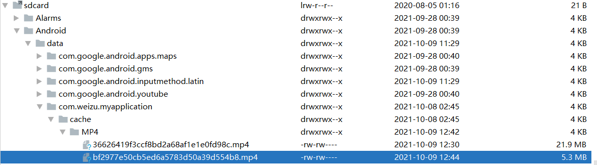

# Android文件下载aar

支持多线程下载，单线程断点下载，多线程断点下载。

## 1. 多线程文件下载示例

```java
public class ThreeActivity extends AppCompatActivity implements View.OnClickListener {
    private Button start;
    private ProgressBar progressbar;
    private MultiThreadDownLoader downloader;

    @Override
    protected void onCreate(@Nullable Bundle savedInstanceState) {
        super.onCreate(savedInstanceState);
        setContentView(R.layout.activity_three);
        start = findViewById(R.id.start);
        progressbar = findViewById(R.id.progressbar);
        progressbar.setMax(100);

        // MultiThreadDownLoader 不提供进度，因为不需要断点下载
        downloader = new MultiThreadDownLoader.Builder(this)
                .url("http://clips.vorwaerts-gmbh.de/big_buck_bunny.mp4")
                .suffix(MultiThreadDownLoader.FileSuffix.MP4)
                .method("GET")
                .cacheDirName("MP4")
                .build();

        start.setOnClickListener(this);
    }

    @Override
    public void onClick(View v) {
        downloader.download(new MultiThreadDownLoader.DownloadListener() {
            @Override
            public void onSuccess(File file) {
                runOnUiThread(new Runnable() {
                    @Override
                    public void run() {
                        Toast.makeText(ThreeActivity.this, "Successful!", Toast.LENGTH_SHORT).show();
                    }
                });
            }

            @Override
            public void onError(String msg) {}
        });
    }
}
```

其实是需要进度反馈的，这里忽略了。应该设计一个接口回调，来进行进度的监听。但在这个学习过程，这个是早期版本，也就是不进行更新了，就默认这样。因为如果需要进度可以选择单线程断点下载，或者多线程版本的断点下载。


## 2. 单线程断点下载示例

```java
public class ThreeActivity extends AppCompatActivity implements View.OnClickListener {
    private Button start, pause;
    private ProgressBar progressbar;
    private SingleThreadBreakpointDownloader downloader;

    @Override
    protected void onCreate(@Nullable Bundle savedInstanceState) {
        super.onCreate(savedInstanceState);
        setContentView(R.layout.activity_three);
        start = findViewById(R.id.start);
        pause = findViewById(R.id.pause);
        progressbar = findViewById(R.id.progressbar);
        progressbar.setMax(100);

        downloader = new SingleThreadBreakpointDownloader.Builder(this)
                .url("http://clips.vorwaerts-gmbh.de/big_buck_bunny.mp4")
                .suffix(SingleThreadBreakpointDownloader.FileSuffix.MP4)
                .cacheDirName("MP4")
                .build();

        start.setOnClickListener(this);

        pause.setOnClickListener(new View.OnClickListener() {
            @Override
            public void onClick(View v) {
                downloader.setIsPause(true);
            }
        });
    }

    @Override
    public void onClick(View v) {
        downloader.download(new SingleThreadBreakpointDownloader.DownLoadListener() {
            @Override
            public void onSuccess(File file) {}

            @Override
            public void onError(String msg) {}

            @Override
            public void onListener(long currentPos, long totalLength) {
                runOnUiThread(new Runnable() {
                    @Override
                    public void run() {
                        int val = (int) (currentPos * 1.0 / totalLength * 100);
                        progressbar.setProgress(val);
                    }
                });
            }
        });
    }
}
```

## 3. 多线程断点下载示例

```java
public class ThreeActivity extends AppCompatActivity implements View.OnClickListener {
    private Button start, pause;
    private ProgressBar progressbar;
    private WMultiThreadBreakpointDownloader downloader;

    @Override
    protected void onCreate(@Nullable Bundle savedInstanceState) {
        super.onCreate(savedInstanceState);
        setContentView(R.layout.activity_three);
        start = findViewById(R.id.start);
        pause = findViewById(R.id.pause);
        progressbar = findViewById(R.id.progressbar);
        progressbar.setMax(100);

        downloader = new WMultiThreadBreakpointDownloader.Builder(this)
                .url("http://vjs.zencdn.net/v/oceans.mp4")
                .suffix(WFileSuffix.MP4)
                .cacheDirName("MP4")
                .build();

        start.setOnClickListener(this);

        pause.setOnClickListener(new View.OnClickListener() {
            @Override
            public void onClick(View v) {
                downloader.setIsPause(true);
            }
        });
    }

    @Override
    public void onClick(View v) {
        downloader.download(new WDownLoadListenerImpl() {
            @Override
            public void onSuccess(File file) {}

            @Override
            public void onError(String msg) {}

            @Override
            public void onProgress(long currentPos, long totalLength) {
                runOnUiThread(new Runnable() {
                    @Override
                    public void run() {
                        int val = (int) (currentPos * 1.0 / totalLength * 100);
                        progressbar.setProgress(val);
                    }
                });
            }
        });
    }
}
```

## 4. 说明

下载数据文件会优先存储在`SD`卡的应用文件夹下。比如：



如果手机没有SD卡，那么会存储在默认存储的应用文件夹中。


也可参考我的记录博客：

- [Android文件多线程下载](https://blog.csdn.net/qq_26460841/article/details/120448220)
- [Android文件多线程下载（二）](https://blog.csdn.net/qq_26460841/article/details/120464292)
- [Android单线程断点下载](https://blog.csdn.net/qq_26460841/article/details/120468704)
- [Android文件多线程断点下载](https://blog.csdn.net/qq_26460841/article/details/120658272)


可以直接使用aar文件，至于如何在AndroidStudio中使用aar包，可以看这篇博客：

- [Android多线程断点下载mylibrary导出aar，并使用](https://blog.csdn.net/qq_26460841/article/details/120672039)


